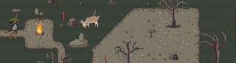
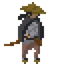

# ColeEngine

A fun project to help me learn C++

---

### Current Key Features:
- ECS component manager
- Collision
	- AABB Collision (no rotation)
	- Circle-Rectangle Collision (axis-alligned rects)
- Animated Sprites
- Projectiles
- Health bars
- Finite State Machines for simple AI

See enviroment setup:
- [MacSetup](docs/setup/MacSetup-CLion.md)
- [WinSetup](docs/setup/WinSetup-VisualStudio.md)

Project backlog here: [TODO](docs/TODO&Backlog.md)
Generate docs: [Doxygen how-to](docs/How-to-use-doxygen.md)
Current sprite art by this guy: [calciumtrice](https://opengameart.org/users/calciumtrice)

